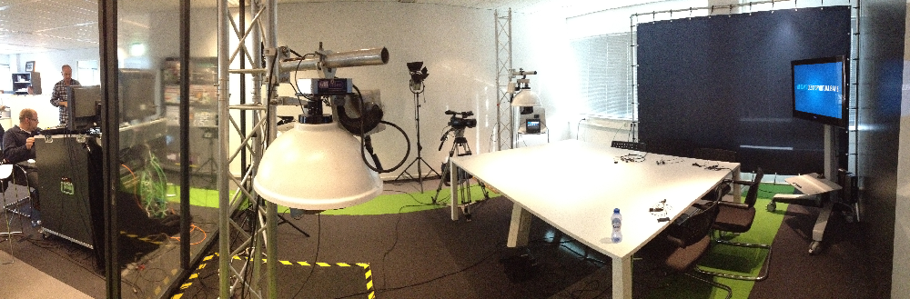

# Werking van systeem

## Introductie

Toen ik bezig was met het opstellen met de lijst van functionaliteiten kwam ik tot de conclusie dat het goed was om een in kaart te brengen wie en wat er allemaal te pas komt aan een webcast, voordat ik een goede lijst met functionaliteiten kan opstellen. Als ik hier een goed beeld van heb kan ik namelijk in kaart brengen welke stakeholders er allemaal zijn. Dan kan ik op basis daarvan per stakeholder de requirements bedenken

## Werking

Connecting Media biedt live streams voor klanten. Dit betekent dat bijvoorbeeld een evenement live uigezonden kan worden zodat mensen op hun computer of mobiel mee kunnen kijken. 

Als voorbeeld neem ik de CMD GOLDEN DOT AWARDS. De HVA wilt graag dat dit evenement ook live via het internet te volgen is omdat het een goede manier is voor exposure van de verschillende studies.

Ik heb alles wat er voor de stream gedaan moet worden opgedeeld in 2 fases. De eerste fase is alles wat er geregeld moet worden voor de live stream. De 2de fase is alles wat er tijdens de stream gebeurd.

**Voor de live stream**

1. Connecting Media maakt een nieuwe live stream aan voor de Hva. de HVA krijgt een eigen stream pagina die ze kunnen delen \(www.url.nl/hva\) en kan deze pagina samen met Connecting Media vormgeven
2. De HVA heeft nu de keuze welke modules ze aan of uit willen hebben. Voor deze stream willen ze dat er polls gedaan kunnen worden en er informatie beschikbaar komt.
3. De HVA regelt zelf de presentator tijdens de CMD GDA en 1 iemand die als moderator aan de gang gaat tijdens de live stream.
4. Connecting Media levert de camera mensen en de live regie.
5. De moderator vanuit de HVA kan van te voren de verschillende modules configuren. Zo kunnen er van te voren bijvoorbeeld al vast polls worden aangemaakt en kan de info module gevuld worden met informatie over de GDA zodat mensen die de stream kijken extra informatie hebben.

**Tijdens de live stream** 

**In** dit plaatje is te zien hoe de opstelling van een live stream er uit ziet. Links achter het glas zit de regie. De regie schakelt de camera's regelt het geluid en zorgt er voor dat er uiteindelijk een live stream naar de kijkers gaat. Links achter het glas zit ook de stream moderator. De moderator zorgt er voor dat de juiste kijkers vragen naar de stream host worden gestuurd en de polls op het juiste moment live gaan. Aan de rechter kant van het glas zit de stream host en haar gasten. 

1. Connecting Media stuurt 2 of 3 mensen die de regie van de webcast doen en de camera's bedienen. 
2. De moderator zit achter een computer om de modules te beheren. Tijdens de webcast kan de moderator bijvoorbeeld polls live zetten zodat de kijkers van de webcast die kunnen beantwoorden. Ze zet een poll live met de vraag: Wat vinden jullie het mooiste project zodat er ook een kijkers jury prijs uitgereikt kan worden. Mensen kunnen nu stemmen.
3. Zodra de moderator vindt dat er genoeg stemmen zijn geweest haalt ze de poll offline en stuurt ze de resultaten door naar de presentator.
4. De host krijgt de uitslagen binnen op een iPad \(zou natuurlijk ook uitgeprint kunnen worden op een kaartje\)

##  

