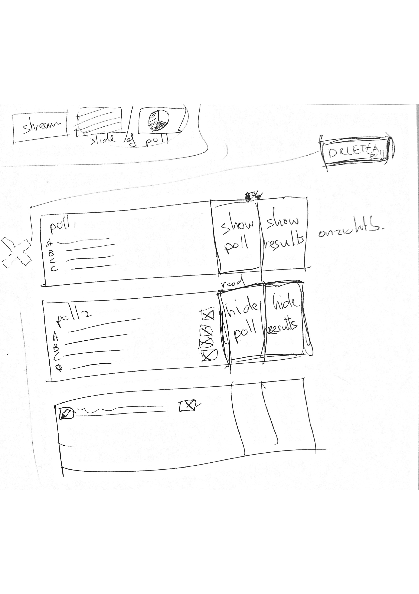

# Functionaliteiten van het systeem

## Introductie

Aan de hand van het interview en de 0 meting ben ik samen met Connecting Media een lijst gaan opstellen met punten voor het nieuwe systeem. We hebben hier bij nog geen rekening gehouden met de tijd en mogelijkheden. Dus alles wat we maar konden bedenken, qua modules, features maar ook punten waar nog verder over na gedacht moet worden.

## Belangrijke punten

**LAMP stack -** Er is een sterke voorkeur voor een lamp stack omdat Connecting Media en het server beheer van Connecting Media hier op dit moment al in werken. Dit betekent dat het naadloos zou aansluiten op de huidige setup

**Responsivness -** De webcast pagina moet ook goed op mobiel werken.

**Wat als mensen de video full screen ? -** De video moet full screen worden maar het liefst zouden we nog steeds de slides module zichtbaar hebben zodra de video fullscreen is? hoe kunnen we dit het best oplossen?

**Statistieken \(zowel op eigen website als misschien via social?\) -** Klanten zouden graag statistieken willen, opties die we tot nu bedacht hebben:  Tab kliks, page refreshes, logins, tijdstamp van kijken en uitloggen, man vrouw?

**Modulair -** Het is belangrijk dat een klant specifieke modules kan hebben. De ene klant zal de stream bijvoorbeeld achter een login willen terwijl hij bij de andere klant open voor publiek mag

**Geen code nodig om een webcast op te zetten -** Op dit moment moet je om een webcast op te zetten in de code duiken. Dit moet niet meer nodig zijn. 

**User management -** Als connecting Media wil je alle streams kunnen aanpassen en beheren, Maar als klant wil je alleen de streams van jezelf kunnen aanpassen. Er zijn dus verschillende accounts niveau's nodig

## m**odules**

**Login**

 Als de login module aan staat moeten gebruikers inloggen voordat ze de livestream kunnen bekijken. Mogelijke login methodes: 

1. Social login, 
2. unieke code die klant dan aan de kijkers kan geven account aanmaken. Dus bijvoorbeeld YTG9Y is de code. die kan de klant verspreiden onder bijvoorbeeld werknemers en iedereen met die code kan dan kijken
3.  mensen inviten met email adress waarna ze zelf een wachtwoord 
4. Mensen kunnen zichzelf aanmelden

Hoe laten we klanten weten wat we met de gegevens doen? als ze gebruik maken van social login of een account aanmaken

**slides \(on demand?\)**

Slides moeten makkelijk te uploaden zijn en voor gezet kunnen worden. Mogelijk ook de optie om videos voor te zetten?

Michiel: Het moet ook makkelijk zijn om de volgorde van slides te veranderen. Dus als je een slide upload moet je daarna ook de volgorde kunnen veranderen zodat er overzicht bewaard kan worden van welke slide live moet gaan. 

Edit: Een slide moet in een preview window komen voordat hij live geschakeld moet worden.

\*\*\*\*

**info pagina \(wysiwig\)**

Een simpele editor waarmee de informatie pagina ingevuld kan worden, moet mogelijk zijn op foto's te uploaden en misschien ook video's?

\*\*\*\*

**poll**

Er moeten tijdens de webcast \(en van te voren?\) polls gemaakt kunnen worden die tijdens de webcast beantwoord kunnen worden. Als de poll wordt gesloten door de redactie moet het resultaat zichtbaar worden in de poll tab. Willen we ook dat de poll uitslag in de livestream voor te schakelen is of als overlay?

Requirements list:

* Polls maken
* Poll aanpassen, zowel de poll vraag als de poll antwoorden. Ook antwoorden kunnen verwijderen of toevoegen
* Ook te gebruiken op tablet \(grote knoppen\)
* Een poll live kunnen zetten en ook weer offline kunnen halen
* De resultaten van een poll laten zien en ook weer offline halen.
* Standaard is er aan de voorkant de stream te zien met daarnaast de slides. Mogelijkheid om de slide te vervangen voor de poll

**vragen stellen**

Een module waarbij klanten vragen kunnen stellen. \(er moet in de backend iets komen waar een overzicht van alle vragen zijn, ook moeten vragen door een redactie goedgekeurd kunnen worden voordat de host van de webcast het ziet. En moeten vragen die zijn beantwoord weer weg gehaald kunnen worden

\*\*\*\*

**Countdown**

Een countdown voordat de stream begint waar te zien is hoelang het nog duurt voordat de stream live gaat

## Conclusie

Een eerste lijst met features en ideeen waar we weer verder op kunnen werken. 

