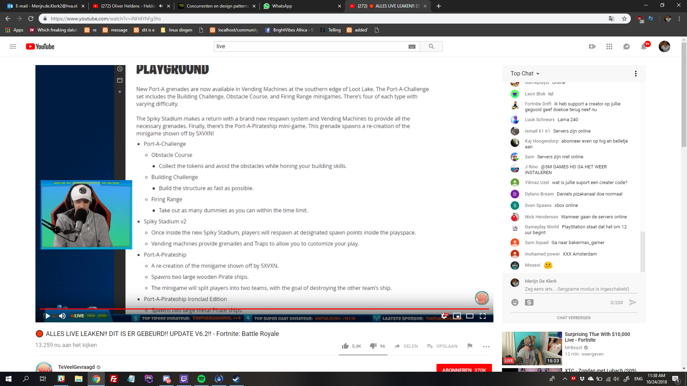

# design patterns Search

Concurrenten en gebruikte Design patterns:

## Live

Vaak zie je dat bedrijven door middel van een icoontje aangeven dat bepaalde content live is.

## Live chat

Bij veel concurrenten is een live chat te zien. Dit gaat om een chat, vaak rechts, van de video stream. Hier kunnen gebruikers die naar de stream kijken met elkaar chatten. Zeker voor een grote stream met veel kijkers is dit een goede manier om mensen betrokken te krijgen

