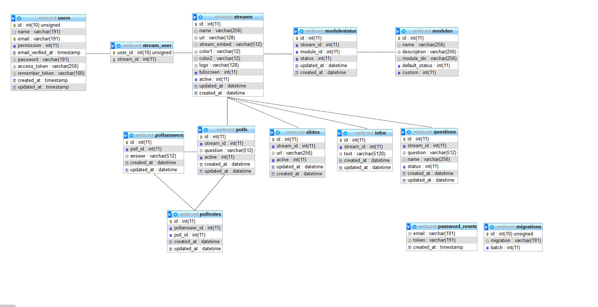
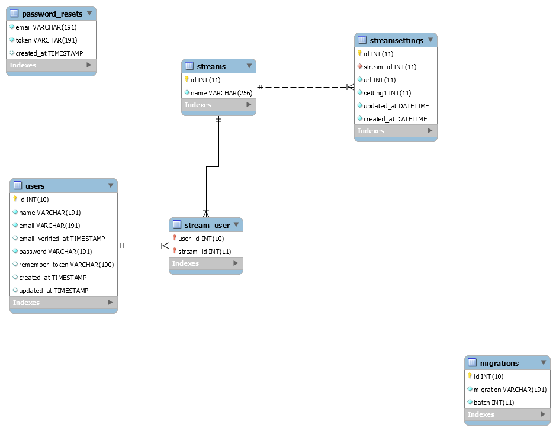

# Database Schema

## Introductie

Belangrijk bij een platform is de manier waarop de database werkt. Door strenge regels aan de database te geven zorg je er voor dat het niet mogelijk is om foutieve informatie in de database te zetten. Hiermee voorkom je errors en bugs in het systeem

## Constrains



In de bovenstaande afbeelding staat de structuur van de database. Door alles aan elkaar te koppelen en constrains mee te geven voorkom je invalide data. Als voorbeeld:

Zodra een nieuwe poll wordt aangemaakt krijgt deze poll een id. Vervolgens als een kijker stemt wordt de stem in de database opgeslagen doormiddel van de id. Dus de poll met id 1 heeft een stem.

Als de database niet gekoppeld zou zijn zou door foutieve data ook een stem uitgebracht kunnen worden voor een poll die niet bestaat. Hierdoor is het systeem onveilig en buf gevoelig

## User table:

### Bcrypt

Passwords worden opgeslagen met een bcrypt op basis van mijn eigen ervaring en de volgende stackoverflow post: "hash Bcrypt has the best kind of repute that can be achieved for a cryptographic algorithm: it has been around for quite some time, used quite widely, "attracted attention", and yet remains unbroken to date".



### User stream verhouding

De user table is door middel van een pivot table \(stream\_users\) gekoppeld aan de stream table. Een user kan dus eigenaar van meerdere streams zijn en een stream kan van meerdere user zijn. 

Als we straks user permissions toevoegen aan de user table kunnen we er voor zorgen dat een 'god' user \(de user met het hoogste permissie niveau, dit zou bijvoorbeeld het account van mijn opdrachtgever zijn\) bij alle streams kan zonder daar rechten voor te hebben via de stream\_users tabel. 

### User sql

```text
CREATE TABLE IF NOT EXISTS `webcast`.`users` (
  `id` INT(10) UNSIGNED NOT NULL AUTO_INCREMENT,
  `name` VARCHAR(191) CHARACTER SET 'utf8mb4' COLLATE 'utf8mb4_unicode_ci' NOT NULL,
  `email` VARCHAR(191) CHARACTER SET 'utf8mb4' COLLATE 'utf8mb4_unicode_ci' NOT NULL,
  `email_verified_at` TIMESTAMP NULL DEFAULT NULL,
  `password` VARCHAR(191) CHARACTER SET 'utf8mb4' COLLATE 'utf8mb4_unicode_ci' NOT NULL,
  `remember_token` VARCHAR(100) CHARACTER SET 'utf8mb4' COLLATE 'utf8mb4_unicode_ci' NULL DEFAULT NULL,
  `created_at` TIMESTAMP NULL DEFAULT NULL,
  `updated_at` TIMESTAMP NULL DEFAULT NULL,
  PRIMARY KEY (`id`),
  UNIQUE INDEX `users_email_unique` (`email` ASC))
ENGINE = InnoDB
AUTO_INCREMENT = 2
DEFAULT CHARACTER SET = utf8mb4
COLLATE = utf8mb4_unicode_ci;
```




```text
| id | name |

public function streamsetting(){
    return $this->hasOne('\App\Streamsetting');
}
```





```text
| id | stream_id | link | video_source

public function stream(){
    return $this->belongsTo('\App\Stream');
    
}
```



## Versie 2

Dit is de uiteindelijk


## Versie 1

Versie 1 van de database



SQL van de eerste database hieronder

```text
-- MySQL Script generated by MySQL Workbench
-- Wed Oct 10 15:36:42 2018
-- Model: WebcastsoftwareDb Version: 1.0
-- MySQL Workbench Forward Engineering

SET @OLD_UNIQUE_CHECKS=@@UNIQUE_CHECKS, UNIQUE_CHECKS=0;
SET @OLD_FOREIGN_KEY_CHECKS=@@FOREIGN_KEY_CHECKS, FOREIGN_KEY_CHECKS=0;
SET @OLD_SQL_MODE=@@SQL_MODE, SQL_MODE='TRADITIONAL,ALLOW_INVALID_DATES';

-- -----------------------------------------------------
-- Schema mydb
-- -----------------------------------------------------
-- -----------------------------------------------------
-- Schema webcast
-- -----------------------------------------------------

-- -----------------------------------------------------
-- Schema webcast
-- -----------------------------------------------------
CREATE SCHEMA IF NOT EXISTS `webcast` DEFAULT CHARACTER SET latin1 ;
USE `webcast` ;

-- -----------------------------------------------------
-- Table `webcast`.`migrations`
-- -----------------------------------------------------
CREATE TABLE IF NOT EXISTS `webcast`.`migrations` (
  `id` INT(10) UNSIGNED NOT NULL AUTO_INCREMENT,
  `migration` VARCHAR(191) CHARACTER SET 'utf8mb4' COLLATE 'utf8mb4_unicode_ci' NOT NULL,
  `batch` INT(11) NOT NULL,
  PRIMARY KEY (`id`))
ENGINE = InnoDB
AUTO_INCREMENT = 3
DEFAULT CHARACTER SET = utf8mb4
COLLATE = utf8mb4_unicode_ci;


-- -----------------------------------------------------
-- Table `webcast`.`password_resets`
-- -----------------------------------------------------
CREATE TABLE IF NOT EXISTS `webcast`.`password_resets` (
  `email` VARCHAR(191) CHARACTER SET 'utf8mb4' COLLATE 'utf8mb4_unicode_ci' NOT NULL,
  `token` VARCHAR(191) CHARACTER SET 'utf8mb4' COLLATE 'utf8mb4_unicode_ci' NOT NULL,
  `created_at` TIMESTAMP NULL DEFAULT NULL,
  INDEX `password_resets_email_index` (`email` ASC))
ENGINE = InnoDB
DEFAULT CHARACTER SET = utf8mb4
COLLATE = utf8mb4_unicode_ci;


-- -----------------------------------------------------
-- Table `webcast`.`streams`
-- -----------------------------------------------------
CREATE TABLE IF NOT EXISTS `webcast`.`streams` (
  `id` INT(11) NOT NULL AUTO_INCREMENT,
  `name` VARCHAR(256) NOT NULL,
  PRIMARY KEY (`id`))
ENGINE = InnoDB
AUTO_INCREMENT = 2
DEFAULT CHARACTER SET = latin1;


-- -----------------------------------------------------
-- Table `webcast`.`streamsettings`
-- -----------------------------------------------------
CREATE TABLE IF NOT EXISTS `webcast`.`streamsettings` (
  `id` INT(11) NOT NULL AUTO_INCREMENT,
  `stream_id` INT(11) NOT NULL,
  `url` INT(11) NOT NULL,
  `setting1` INT(11) NOT NULL,
  `updated_at` DATETIME NOT NULL,
  `created_at` DATETIME NOT NULL,
  PRIMARY KEY (`id`),
  UNIQUE INDEX `stream_id` (`stream_id` ASC),
  CONSTRAINT `streamsettings_ibfk_1`
    FOREIGN KEY (`stream_id`)
    REFERENCES `webcast`.`streams` (`id`))
ENGINE = InnoDB
AUTO_INCREMENT = 2
DEFAULT CHARACTER SET = latin1;


-- -----------------------------------------------------
-- Table `webcast`.`users`
-- -----------------------------------------------------
CREATE TABLE IF NOT EXISTS `webcast`.`users` (
  `id` INT(10) UNSIGNED NOT NULL AUTO_INCREMENT,
  `name` VARCHAR(191) CHARACTER SET 'utf8mb4' COLLATE 'utf8mb4_unicode_ci' NOT NULL,
  `email` VARCHAR(191) CHARACTER SET 'utf8mb4' COLLATE 'utf8mb4_unicode_ci' NOT NULL,
  `email_verified_at` TIMESTAMP NULL DEFAULT NULL,
  `password` VARCHAR(191) CHARACTER SET 'utf8mb4' COLLATE 'utf8mb4_unicode_ci' NOT NULL,
  `remember_token` VARCHAR(100) CHARACTER SET 'utf8mb4' COLLATE 'utf8mb4_unicode_ci' NULL DEFAULT NULL,
  `created_at` TIMESTAMP NULL DEFAULT NULL,
  `updated_at` TIMESTAMP NULL DEFAULT NULL,
  PRIMARY KEY (`id`),
  UNIQUE INDEX `users_email_unique` (`email` ASC))
ENGINE = InnoDB
AUTO_INCREMENT = 2
DEFAULT CHARACTER SET = utf8mb4
COLLATE = utf8mb4_unicode_ci;


-- -----------------------------------------------------
-- Table `webcast`.`stream_user`
-- -----------------------------------------------------
CREATE TABLE IF NOT EXISTS `webcast`.`stream_user` (
  `user_id` INT(10) UNSIGNED NOT NULL,
  `stream_id` INT(11) NOT NULL,
  PRIMARY KEY (`user_id`, `stream_id`),
  INDEX `fk_users_has_streams_streams1_idx` (`stream_id` ASC),
  INDEX `fk_users_has_streams_users1_idx` (`user_id` ASC),
  CONSTRAINT `fk_users_has_streams_users1`
    FOREIGN KEY (`user_id`)
    REFERENCES `webcast`.`users` (`id`)
    ON DELETE NO ACTION
    ON UPDATE NO ACTION,
  CONSTRAINT `fk_users_has_streams_streams1`
    FOREIGN KEY (`stream_id`)
    REFERENCES `webcast`.`streams` (`id`)
    ON DELETE NO ACTION
    ON UPDATE NO ACTION)
ENGINE = InnoDB
DEFAULT CHARACTER SET = utf8mb4
COLLATE = utf8mb4_unicode_ci;


SET SQL_MODE=@OLD_SQL_MODE;
SET FOREIGN_KEY_CHECKS=@OLD_FOREIGN_KEY_CHECKS;
SET UNIQUE_CHECKS=@OLD_UNIQUE_CHECKS;

```

