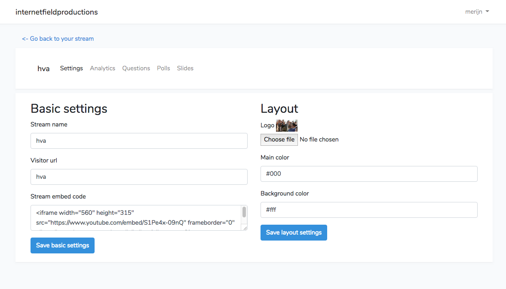

# Expert opinion

01-11-2018 Laurens Aarnoudse

**Users en roles? Moeten stream kijkers ook normale users zijn met een permissie?**

* Is het veilig om ze allebei in dezelfde tabel te hebben? De stream kijker tabel verliezen is vervelend maar geen ramp. Alle klant en admin accounts kwijtraken mag niet gebeuren
* Voorbeelden van andere system? De sis 'bekijk als student functie' die ontzettend onhandig is omdat je daadwerkelijk een student wordt als bad practice?
* als je de users wel in aparte tabellen zet moet je bij het inloggen checken in beide tabellen of er een account is. Dit zorgt  er voor dat de load time langer wordt
* Dit is een bekend probleem binnen systemen. Mogelijk heeft een docent van de afdeling ICT wat nuttige insights? 

\*\*\*\*

**Een groot systeem waar alles in zit vs 3 losse systemen \(Stream pagina, Api, Dashboard\)**

Het loskoppelen van de stream frontend is bijna een must omdat je er voor wilt zorgen dat het schaalbaar is. Zodra er veel gebruikers tegelijk kijken wil je de frontend op meerdere server instances willen kunnen zetten zodat je geen overbelaste servers krijgt. 

Het liefst wil je dat de api het enige punt is waar database mutaties worden gedaan? Dus dashboard en de Stream pagina zijn allebei losse frontends die met de api communiceren voor alle database aanpassingen

14-11-2018 Michiel overheem. \(opdrachtgever\)

**Te veel api calls?**

Het eerste systeem van de slides module is af. Dit werkt op het eerder beschreven rest api systeem. In de dashboard zet je een slide live. De stream frontend van de klant stuurt elke x aantal seconden een call naar de api met de vraag of er al een nieuwe slide is. Nu was ik benieuwd hoe vaak de opdrachtgever vindt dat dit gecheckt moet worden. Ik had zelf ongeveer elke 5/10 seconden in mijn hoofd. Opdrachtgever vind 3 seconden max omdat je niet wilt dat het bijvoorbeeld 10 seconden duurt tot een slide wisselt als je per ongeluk een verkeerde hebt aangeklikt. Toen ik dat door ging bereken bedacht ik me dat het enorm veel api calls naar onze server zijn puur om een keer in de x minuten de slides te wisselen

Want elke 3 seconden bij een stream van 1000 kijkers zou beteken 60s / 3s = 20s \* 1000 = 20000 api calls per minute. Dat is mogelijk een overkill. Dus optioneel toch kijken naar een socket server waarbij de server de nieuwe slide naar de voorkant stuurt uit zichzelf?

**Meerdere save buttons of maar 1?**

Zoals in het screenshot hierboven te zien had de eerste versie van het settings menu 2 save knoppen om de forms op te slaan. Het idee hierachter was informatie meer in delen aanreiken zodat het overzichtelijker bleef zoals hier beschreven:



Echter kwam terecht de opmerking dat het heel verwarrend is als je een veld in het linker en rechter form aanpast en vervolgens op save klikt dat dan maar 2 van de 2 opgeslagen wordt. Dus als suggestie. Of toch 1 knop die alles op slaat. Of de forms verdelen in verschillende submenus waardoor je maar 1 deel van het form per keer ziet!

