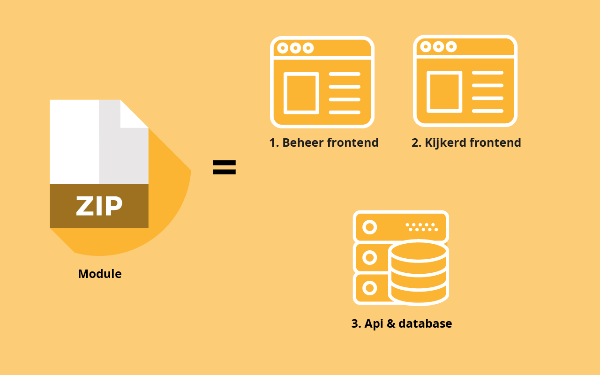

# Modules

## Wat is een module

Het huidige systeem van Connecting Media is niet modulair opgebouwd. Het is hierdoor niet mogelijk om functionaliteiten makkelijk aan en uit te zetten voor specifieke klanten. In het nieuwe platform zijn de functionaliteiten als modules opgezet en is er een user interface omheen gemaakt, hierdoor is het beheren van de verschillende modules veel eenvoudiger.  


Naast een modulaire user interface is de code van functionaliteiten in het nieuwe platform ook modulair. Dit zorgt ervoor dat functionaliteiten makkelijker aangepast en toegevoegd kunnen worden voor ontwikkelaars.



## User journey modules

poll module

1. De moderator kan van te voren of tijdens de webcast een poll aanmaken in het admin dashboard.
2. tijdens de webcast kan de poll live gezet worden in het admin dashboard waardoor kijkers van de webcast hem kunnen invullen
3. Zodra de moderator vind dat er genoeg tijd is geweest om de poll in te vullen kunnen ze hem stoppen
4. De poll uitslag kan nu in een pie chart getoond worden in de stream.
5. De host van de webcast moet ook kunnen zien wat de uitslag was via een ipad om dit in de uitzending te kunnen bespreken 


module

1. Een kijker van de webcast kan tijdens de uitzending een vraag stellen.
2. Deze vraag moet in het admin dashboard zichtbaar worden.
3. Als de moderator het een goede vraag vindt kan hij doorgezet worden naar de webcast host
4. De webcast host krijgt de vraag nu te zien op een iPad en kan nu de vraag behandelen.

In beide gevallen zijn dit dus een aantal handelingen voor zowel de moderator, als de host van de webcast. Vooral voor de host van de webcast is het erg belangrijk dat het bekijken van zowel het resultaat van de poll als het zien van de kijkers vragen makkelijk en zonder veel moeite gaat. We willen namelijk niet dat de host tijdens een uitzending actief op de iPad moet maar alles in 1 oog opslag kan zien.

Ook voor de medewerker van het bedrijf achter de schermen is het belangrijk dat het zo makkelijk mogelijk is om de verschillende modules te beheren tijdens een live webcast.


## functionaliteiten

1. Een module moet makkelijk aan of uit gezet kunnen worden
2. Een module moet een pagina hebben waar de instellingen voor de module gedaan kunnen worden
3. De code van een module moet overzichtelijk zijn
4. Het  moet 'makkelijk' zijn om een nieuwe module te maken


## Good practices 


Wordpress plugins zijn een goed voorbeeld van hoe een grote hoeveelheid modules kunnen werken. 


FBTO modules zijn een ander goed voorbeeld. Met een simpele switch zet je een module aan of uit. 

## Modules qua techniek

De modules hebben 4 aspecten in het dashboard. Een pagina in het dashboard. Een api waar de data mutaties van de module worden gedaan, een javascript class die er voor zorgt dat hij in de frontend werkt en een template.

Zodra de stream frontend wordt geladen vraagt hij aan de server welke modules er allemaal aan moeten. Het antwoord van de server is een JSON:

```text
[
   {
      "id":7,
      "stream_id":10,
      "module_id":1,
      "status":1,
      "updated_at":"2018-12-11 00:05:27",
      "created_at":"2018-12-06 10:11:45",
      "module":{
         "id":1,
         "name":"slides",
         "description":"",
         "module_div":"slidemodule",
         "default_status":0,
         "custom":1
      }
   },
   {
      "id":8,
      "stream_id":10,
      "module_id":2,
      "status":1,
      "updated_at":"2018-12-10 23:57:00",
      "created_at":"2018-12-06 10:11:45",
      "module":{
         "id":2,
         "name":"questions",
         "description":"",
         "module_div":"questionmodule",
         "default_status":0,
         "custom":0
      }
   },
   {
      "id":9,
      "stream_id":10,
      "module_id":3,
      "status":1,
      "updated_at":"2018-12-11 00:05:08",
      "created_at":"2018-12-06 10:11:45",
      "module":{
         "id":3,
         "name":"poll",
         "description":"",
         "module_div":"pollmodule",
         "default_status":0,
         "custom":0
      }
   },
   {
      "id":10,
      "stream_id":10,
      "module_id":4,
      "status":1,
      "updated_at":"2018-12-06 16:27:08",
      "created_at":"2018-12-06 10:11:45",
      "module":{
         "id":4,
         "name":"info",
         "description":"",
         "module_div":"infomodule",
         "default_status":0,
         "custom":0
      }
   }
]
```

Als de module status 1 is betekent dit dat de module aan staat. De modules hebben ook een custom waarde. Als deze custom waarde 0 is wordt de module in het menu gezet. Als custom 1 is wordt de module niet automatisch in het menu gezet en start hij de custom functie in.

