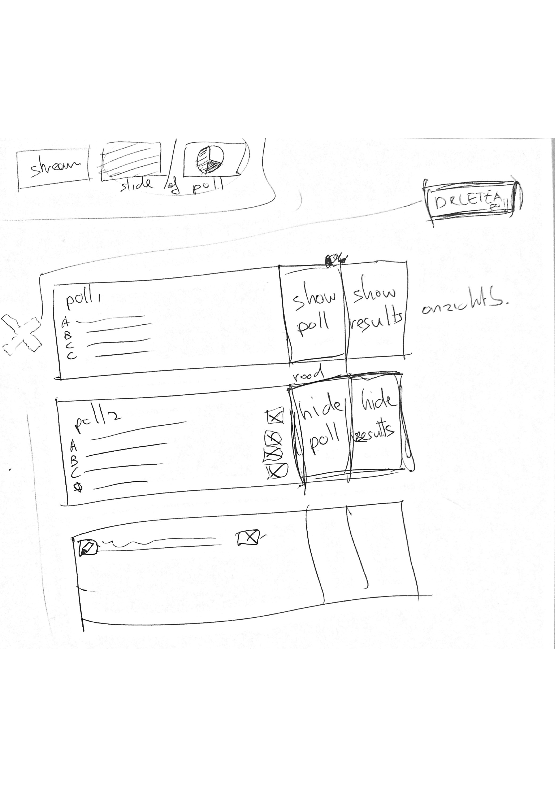

# Poll module

## Functionaliteit

De poll module zorgt er voor dat er vragen aan kijkers gesteld kunnen worden die vervolgens achteraf gebruikt kunnen worden voor analytics, maar ook live tijdens de uitzending behandeld kunnen worden.


## User journey

1. De moderator maakt voor de livestream polls aan
2. zodra de live uitzending is begonnen kunnen de polls live gezet worden
3. zodra een poll live staat kunnen de kijkers stemmen
4. zodra de moderator besluit dat er nog stemmen zijn wordt de poll gesloten
5. De moderator kan de uitslag van de poll nu doorsturen naar de host zodat het in de livestream besproken kan worden

## Requirements:

1. Er moeten meerdere polls aangemaakt kunnen worden
2. De polls moeten aangepast kunnen worden. Dit houdt in, poll verwijderen, poll vraag aanpassen en poll antwoorden toevoegen/deleten/aanpassen 
3. Een poll moet op elk moment live gezet kunnen worden
4. De poll moet offline gehaald kunnen worden
5. het resultaat van de poll moet naar de kijkers gestuurd kunnen worden

UI




1. Een nieuwe poll aanmaken doe je door de vraag van de poll in te typen en op Create poll te drukken
2. Zodra een nieuwe poll is aangemaakt komt hij in de lijst te staan. Hier kan je antwoorden toevoegen/verwijderen, de poll vraag aanpassen of de hele poll verwijderen
3. Door op “Go Live” te klikken gaat de poll live voor de kijkers die er dan op kunnen stemmen
4. Door op “Show result” te klikken krijgt de stream host de uitslag van die poll te zien


## Techniek

Poll api

```text
<?php

namespace App\Http\Controllers\Modules\Polls;

use App\Poll;
use App\Pollanswer;
use App\Pollvote;
use Illuminate\Http\Request;
use App\Http\Controllers\Controller;
use Carbon\Carbon;
use App\Stream;
use Illuminate\Support\Facades\App;
use Illuminate\Support\Facades\Auth;
use Illuminate\Support\Facades\DB;


class PollApiController extends Controller
{
    /**
     * Create a new controller instance.
     *
     * @return void
     */
    public function __construct()
    {
    }

    /**
     * Show the application dashboard.
     *
     * @return \Illuminate\Http\Response
     */
    public function getActivePoll(Request $request)
    {
        //TODO: mag deze user poll opvragen

        $poll = Poll::with('pollanswer')->where('stream_id' , '=', $request->input('stream_id'))->where('active', '=', 1)->first();

        return json_encode($poll);

    }

    public function setActivePoll(Request $request){

        DB::table('polls')
            ->where('stream_id', $request->input('stream_id'))
            ->update(['active' => 0]);


        $poll = \App\Poll::find($request->input('poll_id'));
        $poll->active = 1;
        $poll->save();

        return json_encode($poll);
    }


    public function getPollResults(Request $request)
    {
        //TODO: mag deze user poll opvragen

//        $poll = Poll::with('pollanswer')->where('stream_id' , '=', $request->input('stream_id'))->get();


        $polls_array = [];

        $polls = Poll::get()->load(['pollanswer', 'pollanswer.pollvote'])->where('stream_id' , '=', $request->input('stream_id'));


        //door de load functie wordt het een object en geen array
        foreach($polls as $poll){
            array_push($polls_array, $poll);
        }

        return json_encode($polls_array);


    }


    public function postPollVote(Request $request){
        $pollvote = new Pollvote();
        $pollvote->pollanswer_id = $request->input('answer_id');
        $pollvote->poll_id = $request->input('poll_id');
        $pollvote->save();

        return json_encode(["message" => "You have voted for the poll that is currently active", "code" => 200]);
    }

}
```


Poll session based request:


```text
<?php

namespace App\Http\Controllers\Modules\Polls;

use App\Poll;
use App\Pollanswer;
use Illuminate\Http\Request;
use App\Http\Controllers\Controller;
use Carbon\Carbon;
use App\Stream;
use Illuminate\Support\Facades\Auth;


class PollController extends Controller
{
    /**
     * Create a new controller instance.
     *
     * @return void
     */
    public function __construct()
    {
        $this->middleware('auth');
    }

    /**
     * Show the application dashboard.
     *
     * @return \Illuminate\Http\Response
     */
    public function index($id)
    {
        $stream = Stream::with('poll.pollanswer')->find($id);


        if (!Auth::user()->can('view', $stream)) {
            abort(403, 'Unauthorized action.');
        }


        return view('modules/polls/home', ['stream' => $stream, 'polls' => $stream->poll]);
    }

    public function addPoll($id, Request $request){
        $stream = Stream::find($id);

        if (!Auth::user()->can('update', $stream)) {
            abort(403, 'Unauthorized action.');
        }

        $poll = new Poll();
        $poll->stream_id = $id;
        $poll->question = $request->input('question');
        $poll->active = 0;
        $poll->save();

        return redirect()->back();
    }

    public function addPollAnswer($id, Request $request){
        //TODO: check if the user is allowed to add a answer fro this poll

        $stream = Stream::find($id);

        if (!Auth::user()->can('update', $stream)) {
            abort(403, 'Unauthorized action.');
        }

        $pollAnswer = new Pollanswer();
        $pollAnswer->poll_id = $request->input('pollid');
        $pollAnswer->answer = $request->input('pollanswer');
        $pollAnswer->save();

        return redirect()->back();
    }
}

```


Databases:

polls

```text
-- phpMyAdmin SQL Dump
-- version 4.8.3
-- https://www.phpmyadmin.net/
--
-- Host: 127.0.0.1
-- Gegenereerd op: 16 jan 2019 om 17:42
-- Serverversie: 10.1.36-MariaDB
-- PHP-versie: 7.2.10

SET SQL_MODE = "NO_AUTO_VALUE_ON_ZERO";
SET AUTOCOMMIT = 0;
START TRANSACTION;
SET time_zone = "+00:00";


/*!40101 SET @OLD_CHARACTER_SET_CLIENT=@@CHARACTER_SET_CLIENT */;
/*!40101 SET @OLD_CHARACTER_SET_RESULTS=@@CHARACTER_SET_RESULTS */;
/*!40101 SET @OLD_COLLATION_CONNECTION=@@COLLATION_CONNECTION */;
/*!40101 SET NAMES utf8mb4 */;

--
-- Database: `webcast`
--

-- --------------------------------------------------------

--
-- Tabelstructuur voor tabel `polls`
--

CREATE TABLE `polls` (
  `id` int(11) NOT NULL,
  `stream_id` int(11) NOT NULL,
  `question` varchar(512) NOT NULL,
  `active` int(11) NOT NULL,
  `created_at` datetime NOT NULL,
  `updated_at` datetime NOT NULL
) ENGINE=InnoDB DEFAULT CHARSET=latin1;

--
-- Gegevens worden geëxporteerd voor tabel `polls`
--

INSERT INTO `polls` (`id`, `stream_id`, `question`, `active`, `created_at`, `updated_at`) VALUES
(1, 8, 'dit is een vraag', 0, '0000-00-00 00:00:00', '2018-12-04 14:02:15'),
(2, 8, 'dit is een andere vraag', 0, '0000-00-00 00:00:00', '2018-12-04 15:29:38'),
(3, 8, 'test test', 1, '2018-11-23 14:28:22', '2018-12-05 14:18:17'),
(4, 8, 'another poll', 0, '2018-11-23 14:28:28', '2018-11-30 15:41:28'),
(5, 8, 'Wat is Connecting Media', 0, '2018-11-30 15:19:18', '2018-11-30 15:41:32'),
(6, 10, 'test', 0, '2018-12-11 00:04:54', '2018-12-11 00:04:54'),
(7, 11, 'Tussen welke studies twijfel je?', 0, '2018-12-16 20:31:31', '2018-12-16 20:57:49'),
(8, 11, 'test', 1, '2018-12-16 20:32:39', '2018-12-16 20:58:29'),
(9, 13, 'Wat vind jij hiervan', 0, '2019-01-10 22:14:41', '2019-01-10 22:14:53'),
(10, 13, 'kasldhsad', 1, '2019-01-10 22:16:34', '2019-01-10 22:16:45');

--
-- Indexen voor geëxporteerde tabellen
--

--
-- Indexen voor tabel `polls`
--
ALTER TABLE `polls`
  ADD PRIMARY KEY (`id`);

--
-- AUTO_INCREMENT voor geëxporteerde tabellen
--

--
-- AUTO_INCREMENT voor een tabel `polls`
--
ALTER TABLE `polls`
  MODIFY `id` int(11) NOT NULL AUTO_INCREMENT, AUTO_INCREMENT=11;
COMMIT;

/*!40101 SET CHARACTER_SET_CLIENT=@OLD_CHARACTER_SET_CLIENT */;
/*!40101 SET CHARACTER_SET_RESULTS=@OLD_CHARACTER_SET_RESULTS */;
/*!40101 SET COLLATION_CONNECTION=@OLD_COLLATION_CONNECTION */;

```

poll votes

```text
-- phpMyAdmin SQL Dump
-- version 4.8.3
-- https://www.phpmyadmin.net/
--
-- Host: 127.0.0.1
-- Gegenereerd op: 16 jan 2019 om 17:42
-- Serverversie: 10.1.36-MariaDB
-- PHP-versie: 7.2.10

SET SQL_MODE = "NO_AUTO_VALUE_ON_ZERO";
SET AUTOCOMMIT = 0;
START TRANSACTION;
SET time_zone = "+00:00";


/*!40101 SET @OLD_CHARACTER_SET_CLIENT=@@CHARACTER_SET_CLIENT */;
/*!40101 SET @OLD_CHARACTER_SET_RESULTS=@@CHARACTER_SET_RESULTS */;
/*!40101 SET @OLD_COLLATION_CONNECTION=@@COLLATION_CONNECTION */;
/*!40101 SET NAMES utf8mb4 */;

--
-- Database: `webcast`
--

-- --------------------------------------------------------

--
-- Tabelstructuur voor tabel `pollvotes`
--

CREATE TABLE `pollvotes` (
  `id` int(11) NOT NULL,
  `pollanswer_id` int(11) NOT NULL,
  `poll_id` int(11) NOT NULL,
  `created_at` datetime NOT NULL,
  `updated_at` datetime NOT NULL
) ENGINE=InnoDB DEFAULT CHARSET=latin1;

--
-- Gegevens worden geëxporteerd voor tabel `pollvotes`
--

INSERT INTO `pollvotes` (`id`, `pollanswer_id`, `poll_id`, `created_at`, `updated_at`) VALUES
(1, 5, 0, '2018-12-04 13:40:49', '2018-12-04 13:40:49'),
(12, 21, 9, '2019-01-10 22:15:45', '2019-01-10 22:15:45');

--
-- Indexen voor geëxporteerde tabellen
--

--
-- Indexen voor tabel `pollvotes`
--
ALTER TABLE `pollvotes`
  ADD PRIMARY KEY (`id`);

--
-- AUTO_INCREMENT voor geëxporteerde tabellen
--

--
-- AUTO_INCREMENT voor een tabel `pollvotes`
--
ALTER TABLE `pollvotes`
  MODIFY `id` int(11) NOT NULL AUTO_INCREMENT, AUTO_INCREMENT=13;
COMMIT;

/*!40101 SET CHARACTER_SET_CLIENT=@OLD_CHARACTER_SET_CLIENT */;
/*!40101 SET CHARACTER_SET_RESULTS=@OLD_CHARACTER_SET_RESULTS */;
/*!40101 SET COLLATION_CONNECTION=@OLD_COLLATION_CONNECTION */;

```

poll answers

```text
-- phpMyAdmin SQL Dump
-- version 4.8.3
-- https://www.phpmyadmin.net/
--
-- Host: 127.0.0.1
-- Gegenereerd op: 16 jan 2019 om 17:42
-- Serverversie: 10.1.36-MariaDB
-- PHP-versie: 7.2.10

SET SQL_MODE = "NO_AUTO_VALUE_ON_ZERO";
SET AUTOCOMMIT = 0;
START TRANSACTION;
SET time_zone = "+00:00";


/*!40101 SET @OLD_CHARACTER_SET_CLIENT=@@CHARACTER_SET_CLIENT */;
/*!40101 SET @OLD_CHARACTER_SET_RESULTS=@@CHARACTER_SET_RESULTS */;
/*!40101 SET @OLD_COLLATION_CONNECTION=@@COLLATION_CONNECTION */;
/*!40101 SET NAMES utf8mb4 */;

--
-- Database: `webcast`
--

-- --------------------------------------------------------

--
-- Tabelstructuur voor tabel `pollanswers`
--

CREATE TABLE `pollanswers` (
  `id` int(11) NOT NULL,
  `poll_id` int(11) NOT NULL,
  `answer` varchar(512) NOT NULL,
  `created_at` datetime NOT NULL,
  `updated_at` datetime NOT NULL
) ENGINE=InnoDB DEFAULT CHARSET=latin1;

--
-- Gegevens worden geëxporteerd voor tabel `pollanswers`
--

INSERT INTO `pollanswers` (`id`, `poll_id`, `answer`, `created_at`, `updated_at`) VALUES
(1, 1, 'boe', '0000-00-00 00:00:00', '0000-00-00 00:00:00'),
(24, 10, 'ghfhgfhgf', '2019-01-10 22:16:42', '2019-01-10 22:16:42');

--
-- Indexen voor geëxporteerde tabellen
--

--
-- Indexen voor tabel `pollanswers`
--
ALTER TABLE `pollanswers`
  ADD PRIMARY KEY (`id`);

--
-- AUTO_INCREMENT voor geëxporteerde tabellen
--

--
-- AUTO_INCREMENT voor een tabel `pollanswers`
--
ALTER TABLE `pollanswers`
  MODIFY `id` int(11) NOT NULL AUTO_INCREMENT, AUTO_INCREMENT=25;
COMMIT;

/*!40101 SET CHARACTER_SET_CLIENT=@OLD_CHARACTER_SET_CLIENT */;
/*!40101 SET CHARACTER_SET_RESULTS=@OLD_CHARACTER_SET_RESULTS */;
/*!40101 SET COLLATION_CONNECTION=@OLD_COLLATION_CONNECTION */;

```

