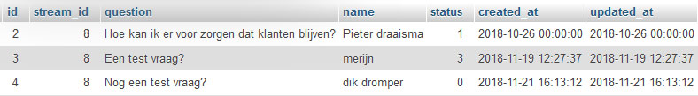

# Question module

## Intro

De question module zorgt er voor dat klanten vragen kunnen stellen aan de sprekers en host van de stream zodat deze vragen live behandeld en beantwoord kunnen worden. Hierdoor worden kijkers meer betrokken bij een livestream.

## User journey

1. Kijker stelt een vraag
2. De vraag komt binnen bij de moderator
3. De moderator besluit of de vraag door gaat naar de host
4. Als de vraag goed genoeg is krijgt de host hem te zien

## Kijkers sturen niet alleen goede vragen

Tijdens het analyseren van verschillende databases met kijkers vragen van livestreams die Connecting Media in het verleden heeft gedaan, is duidelijk te zien dat gebruikers niet alleen inhoudelijke vragen stellen die behandeld kunnen worden tijdens de stream. Maar bijvoorbeeld ook vragen als: “Waarom werkt de stream niet bij mij?”. Met deze reden kunnen moderators in het nieuwe systeem kijkersvragen selecteren die goed zijn. De host van het gesprek wordt hierdoor zo min mogelijk belast met andere dingen naast het leiden van een gesprek en ziet alleen de vragen die nuttig zijn.


## UI


## Techniek


```text
<?php

namespace App\Http\Controllers\Modules\Questions;

use App\Stream;
use Illuminate\Http\Request;
use App\Http\Controllers\Controller;


class QuestionsApiController extends Controller
{
    /**
     * Create a new controller instance.
     *
     * @return void
     */
    public function __construct()
    {
    }

    /**
     * Show the application dashboard.
     *
     * @return \Illuminate\Http\Response
     */
    public function postQuestion(Request $request)
    {
        $question = new \App\Question();
        $question->stream_id = $request->input('streamid');
        $question->question = $request->input('question');
        $question->name = $request->input('name');
        $question->save();

        return json_encode(['message' => 'question has been send', 'code'=>200]);
    }

    public function getQuestions(Request $request){
        $stream = Stream::find($request->input('stream_id'));

        $user = \App\User::where('access_token' , '=' , $request->input('access_token'))->first();

        if($user){
            if (!$user->can('update', $stream)) {
                abort(403, 'Unauthorized action.');
            }
        }else{
            abort(403, 'Unauthorized action.');
        }

        return json_encode($stream->question()->get());
    }
}
```

Zoals in de code te zien bestaat de api nu uit 2 endpoint, getQuestion en postQuestion. Hiermee is het nog niet mogelijk om de vragen door verschillende stappen te laten lopen. De database is hier wel al op ingericht.



