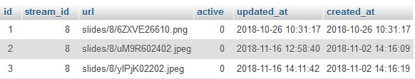

# Slide module

De slide module zorgt er voor dat er live tijdens een uitzending slides voorgeschakeld kunnen worden. 


## Requirements slide module:

1. Er moeten slides geupload kunnen worden
2. De slides moeten live voorgeschakeld kunnen worden
3. Voordat de slides live gaan moeten er een preview zijn

## Design patterns

Live/preview


In de afbeelding hierboven is wirecast te zien. Dit is een programma waarin de live video signalen uitgestuurd worden. Te zien is hoe onder de verschillende signalen te zien zijn. Rechts is een preview te zien van een van deze signalen en links is het signaal dat op dit moment live is.


## UI


1. Hier kunnen slides \(afbeeldingen\) geupload worden
2. Thumbnails van de slides verschijnen in deze lijst
3. Zodra een van de slides wordt aangeklikt verschijnt er een preview van de slide
4. Zodra er op de “Set live” knop wordt gedrukt wordt de slide live gezet
5. De slide die op dit moment live is staat hier


## Technisch

De slide api controller:

```text
<?php

namespace App\Http\Controllers\Modules\Slides;

use Illuminate\Http\Request;
use App\Http\Controllers\Controller;
use Carbon\Carbon;
use App\Stream;
use Illuminate\Support\Facades\App;
use Illuminate\Support\Facades\Auth;
use Illuminate\Support\Facades\DB;


class SlidesApiController extends Controller
{
    /**
     * Create a new controller instance.
     *
     * @return void
     */
    public function __construct()
    {

    }

    public function getSlide(Request $request){
        $slide = \App\Slide::where('active', '=', 1)->where('stream_id', '=', $request->input('stream_id'))->first();

        print_r(json_encode($slide));

    }


    public function setLive($id, Request $request){
        //TODO: check if the user is allowed to set this slide life (atm only all admin users can do that)
        $slide = \App\Slide::find($request->input('slide_id'));
        $user = \App\User::where('access_token' , '=' , $request->input('access_token'))->first();

        if($user){
            if (!$user->can('update', $slide)) {
                abort(403, 'Unauthorized action.');
            }
        }else{
            abort(403, 'Unauthorized action.');
        }

        DB::table('slides')
            ->where('stream_id', $slide->stream_id)
            ->update(['active' => 0]);


        $slide = \App\Slide::find($request->input('slide_id'));
        $slide->active = 1;
        $slide->save();

        return response()->json($slide, 200);

    }

    public function uploadSlides($id, Request $request){

        $stream = Stream::find($id);
        $user = \App\User::where('access_token' , '=' , $request->input('access_token'))->first();

        if($user){
            if (!$user->can('update', $stream)) {
                abort(403, 'Unauthorized action.');

            }
        }else{
            abort(403, 'Unauthorized action.');
        }


        $this->validate($request, [
            'file' => 'required|image|mimes:jpeg,png,jpg,gif,svg|max:4096',
        ]);

        // Creating a new time instance, we'll use it to name our file and declare the path
        $time = Carbon::now();
        // Requesting the file from the form
        $image = $request->file('file');
        // Getting the extension of the file
        $extension = $image->getClientOriginalExtension();
        // Creating the directory, for example, if the date = 18/10/2017, the directory will be 2017/10/
        $directory ='slides/' . $id;
        // Creating the file name: random string followed by the day, random number and the hour
        $filename = str_random(5).date_format($time,'d').rand(1,9).date_format($time,'h').".".$extension;
        // This is our upload main function, storing the image in the storage that named 'public'
        $upload_success = $image->storeAs($directory, $filename, 'public');
        // If the upload is successful, return the name of directory/filename of the upload.
        if ($upload_success) {
            $slide = new \App\Slide();
            $slide->url = $directory . "/" . $filename;
            $slide->stream_id = $id;
            $slide->active = 0;
            $slide->save();

            $succes_msg = ['url' => $upload_success];

            return response()->json($succes_msg, 200);
        }
        // Else, return error 400
        else {
            return response()->json('error', 400);
        }


    }
}

```

De controller bevat 3 methods:

getSlide returned de slide die op dit moment active staat, setSllide veranderd de slide die op dit moment live staat en uploadSlide upload een nieuwe slide vanaf de client naar de server.


Voorbeeld van de database:



