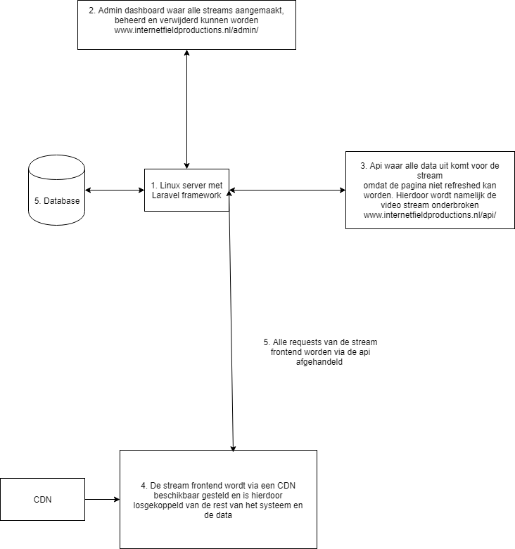
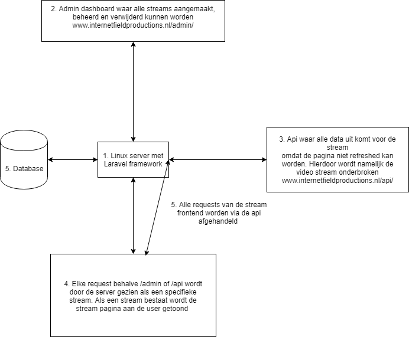
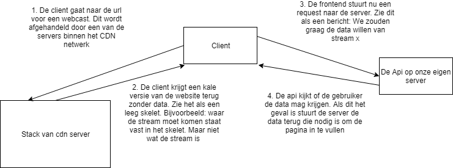
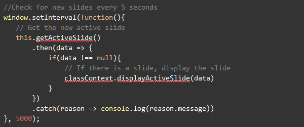

# Server infrastructuur

## Introductie

Nu het duidelijk is met welke tools het systeem ontwikkeld gaat worden is het tijd om te kijken naar hoe het systeem gaat werken. De laatste jaren is het steeds populairder geworden om API's te gebruiken om data tussen de client \(webcast kijker\) en de server in plaats van de traditionele methode. In dit hoofdstuk ga ik onderbouwen 

## Eerste opzet:

Het systeem bestaat uit 3 subsystemen, dit kunnen uiteindelijk 3 losse systemen worden. Of ze kunnen allemaal binnen het zelfde systeem werken.

### Systeem 1 \(de achterkant/admin portal\)

Subsysteem 1 is de achterkant van elke webcast. Dit wordt een platform waar gebruikers kunnen inloggen en vervolgens webcasts kunnen aanmaken en verschillende modules kunnen aan en uitzetten en instellingen kunnen veranderen. Voorbeelden van instellingen zijn bijvoorbeeld het logo van de klant, naam, hoofdkleur enzovoort. Ook kan via deze achterkant achteraf bijvoorbeeld gekeken worden hoe de webcast het heeft gedaan qua aantal kijkers. 

Opzetten van de webcast / het platform:

1. Admin account logged in op het webcast platform
2. Er wordt een nieuwe webcast gemaakt
3. De nieuwe webcast kan ingesteld worden. Modules kunnen aan en uit gezet worden, er kan een logo en titel ingevuld worden en bijvoorbeeld custom kleuren.

### Systeem 2 \(de voorkant\)

Dit is de pagina waarop de webcast bekeken kan worden. Deze pagina heeft een standaard layout die vervolgens wordt aangepast aan de hand van de instellingen van de backend. De logo op deze pagina zal dus uniek zijn per klant en ook zullen er andere elementen op de pagina aan te passen zijn \(staat op dit moment nog niet vast welke\)

Op deze pagina zal de gebruiker dus de stream kijken maar ook Interactief bezig zijn door bijvoorbeeld vragen in te sturen of een poll te beantwoorden. **Dit systeem moet dus via een api werken, de pagina mag namelijk niet refreshen omdat dit de stream onderbreekt**. 

### Systeem 3 \(de API\)

Dit systeem zal de verbinding tussen systeem 1 en 2 zijn. Zodra een gebruiker de webcast pagina opent wordt er een call gedaan naar dit systeem om de juiste instellingen op te halen. Zodra een gebruik een vraag stelt wordt die vraag naar dit systeem gestuurd, dit systeem checkt vervolgens of de gebruiker de vraag mag stellen \(is hij ingelogd als de inlog module aan staat, is er een valide api token en stelt hij niet te veel vragen\) en als alles goed is slaat het systeem de vraag op zodat hij in de webcast behandeld kan worden. 

## Meer de diepte in: 01-10-18







Hierboven zijn 2 concept schema's te zien van de werking van de servers. Voor een groot deel werken beide concepten hetzelfde:

De server zelf. Deze draait om een standaart LAMP stack \(Linux, Apache, Mysql, PHP\). Als database gebruiken we alleen de MariaDB fork van Mysql omdat de performance beter is. De security patches sneller uitgebracht worden en de productie van MariaDB open source is. Bronnen: [https://blog.panoply.io/a-comparative-vmariadb-vs-mysql](https://blog.panoply.io/a-comparative-vmariadb-vs-mysql) & [https://seravo.fi/2015/10-reasons-to-migrate-to-mariadb-if-still-using-mysql](https://seravo.fi/2015/10-reasons-to-migrate-to-mariadb-if-still-using-mysql). Verder draait het php framework Laravel op de server.

Het admin dashboard is een standaard session based website met een traditionele request handling. Dit houdt in dat een request naar de server wordt gestuurd. De server de request afhandelt en de juiste kant en klare pagina weer terug stuurt naar de gebruiker. Elke keer als er dus op een link wordt gedrukt zal er een nieuwe request gestuurd worden naar de server waarna de gebruiker de nieuwe pagina voorgeschoteld krijgt. 

De api is de schakel tussen de stream pagina en de database. Zoals te zien is in beide concepten hierboven gaat een request van de stream \(nummer 4\) naar de server die het vervolgens door het api systeem laat afhandelen en de juiste data weer terug stuurt naar de stream. Denk dan bijvoorbeeld aan het invullen van een poll tijdens een live uitzending. De gebruiker vult de poll in, het resultaat wordt naar de api gestuurd die het resultaat opslaat en een succes bericht terug stuurt naar de client.

Dit is het gedeelte waar het verschil zit tussen de 2 concepten. In concept 1 \(Diagram 1\) staat het frontend systeem op een CDN \(Content Delivery Network\). Dit houdt in dat de stream website los gekoppeld staat van de rest van het systeem. Zodra een klant een stream opzoekt krijgt hij de website voorgeschoteld vanaf de CDN. Omdat alle data later pas via de api binnen komt is dit heel snel. In grafiek 3 is te zien hoe dit zou werken. Elke keer als de client een nieuw stukje data nodig heeft of juist iets wilt opslaan wordt er dus een request gestuurd naar de api.

 



In concept 2 \(Diagram 2\) Werkt dit systeem grotendeels hetzelfde. Het grote verschil is dat de website in eerste instantie al door onze eigen server naar de client gestuurd wordt. Hierdoor kan gelijk de juiste data meegestuurd worden. Dus in plaats van eerst een leeg skelet dat daarna gevuld wordt. Is het skelet gelijk gevuld zover mogelijk. Wat vervolgens nog aan nieuwe data binnen komt of uit gaat werkt zelfde als bij concept 1.

Concept 1 is qua netheid zeker de way to go. Dit omdat je een mooi los project hebt dat niks te maken heeft met de data en het dashboard. Qua tijd is concept 2 alleen meer haalbaar. Hierdoor zou het mogelijk kunnen zijn dat ik in het eerste werkende prototype systeem 2 toepas. Echter kan dit relatief simpel losgekoppeld worden en omgebouwd tot concept 1 in een later stadium. 

Verdere specificaties voor de stream website zijn: HTML5, CSS3/Sass, Javascript/ES6 met webpack & babel voor compiling en building. Ik kijk nog naar vue.js als frontend maar omdat het project vooral gericht is op de achterkant van het systeem weet ik nog niet of ik hier aan toe kom.

## Nieuw inzicht

Het bovenstaande concept heb ik voorgelegd bij Laurens Aarnoudse. Hij kwam met de goeie vraag. Waarom Communiceert alleen de frontend van de stream met de api. En de backend niet? Dit ga ik nog even verder toelichten en heroverwegen. Zoals ik hierboven uitleg was het idee om het dashboard als een traditionele website te laten werken: "_Het admin dashboard is een standaard session based website met een traditionele request handling. Dit houdt in dat een request naar de server wordt gestuurd. De server de request afhandelt en de juiste kant en klare pagina weer terug stuurt naar de gebruiker._" BRON HIERBOVEN? 

Laurens vroeg terecht. Waarom zou je alle data mutaties van de frontend wel via een api doen en die van de backend niet. Om uit te leggen waarom dat raar is een voorbeeld: Een kijker van de stream die straks een vraag stelt doet dat via de api. Als je die vraag in het admin dashboard wilt bekijken gaat dat echter gewoon via een een session based request. Is het niet veel logischer dat de vragen ook weer via de api naar het admin dashboard worden gestuurd.

Toen ik hier verder over na dacht kwam bedacht ik me nog 2 redenen waarom alles via de api een veel beter idee is:

1. Je hoeft alleen de api te beveiligen. Je kan dus security policies schrijven in de api die aangeven wie wat mag doen. In het originele concept zou je 2 losse beveiliging systemen hebben. Een in de api en een in het dashboard. Hierdoor wordt het veel overzichtelijker wie wat mag.
2. Toen ik nog eens aan het nadenken was over dit systeem heb ik ook de PVE er bij gepakt die ik samen met de opdrachtgever heb opgesteld. Hierin staat bijvoorbeeld dat de vragen live beheert moet kunnen worden. Dit zou met een api moeten gebeuren. Anders moet de moderator elke keer refreshen om nieuwe vragen te zien. Dus een deel van het dashboard zou hoe dan ook api based moeten zijn.

Het uiteindelijke schema is dus:


1. Client gaat naar het admin portal en stuurt een request dat wordt opgevangen door de CDN
2. De CDN stuurt een statische frontend terug naar de gebruiker
3. Elke handeling van de gebruiker wordt met een async request naar de api gestuurd.
4. De api doet de transformatie in de database en stuurt een JSON objet terug naar de gebruiker.
5. Een stream kijker stuurt een request om een stream te kijken
6. De CDN stuurt een statische frontend terug voor het bekijken van de stream
7. Async requests worden naar de api gestuurd om alle data op te halen voor het kijken van de stream
8. De api haalt alle benodigde data uit de database en stuurt dit terug naar de gebruiker


## Code



Dit is een voorbeeld van de code die elke 5 seconden de nieuwste slide uit de api haalt:

 

```text
public function getSlide(Request $request){
    $slide = \App\Slide::where('active', '=', 1)->where('stream_id', '=', $request->input('stream_id'))->first();

    print_r(json_encode($slide));

}
```

Een kanttekening aan deze opzet is dat de frontend dus 1 keer in de 5 seconden request naar de api stuurt om te kijken of er nog nieuwe content is, ook is er geen nieuwe content.  


Dit zou voorkomen kunnen worden door Sockets te gebruiken. Dit houdt in dat de server de content naar de kijkers pushed zodra er iets nieuws is. Hiermee voorkom je veel onnodig data verkeer. Ik heb er voor gekozen om voor polling te gaan om de scope voor het project.

## Conclusie

Conclusie is dus dat het hele systeem via een api laten communiceren sowieso een betere optie is. Zowel het admin dashboard als de stream frontend sturen dus request naar de api. De api doet vervolgens de database mutatie of stuurt de opgevraagde data weer terug.


